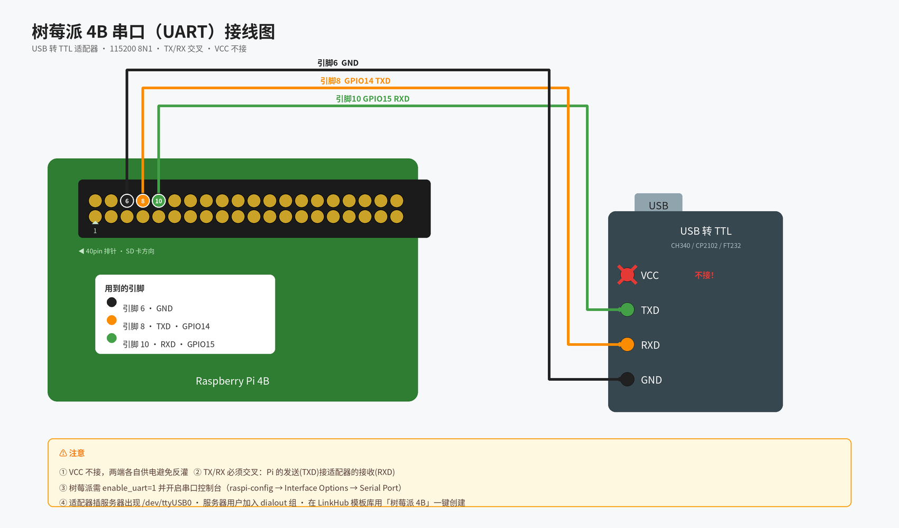

# 🐙 灵枢 LinkHub — 设备连接平台

> 一个平台，连接所有设备。
> 吉祥物：**连连**，一只八条触手各握一种线缆的小章鱼 🐙

```
        _______________
       /  灵枢 LinkHub \
      |   ___________   |
      |  /           \  |
      | |  ^     ^   |  |      触手即连接：
      | |  •  ω  •   |  |  ┌── USB/串口 ── 树莓派
       \ \   ‿‿‿   / /   ├── SSH ──────── 开发板/服务器（P2）
        \ \_______/ /    ├── 蓝牙 BLE ──── 传感器（P3）
       ~/|  |   |  |\~   └── MQTT ─────── IoT 设备群（P3）
      ~ / |  |   |  | \ ~
       /  |  |   |  |  \
     USB  TX RX  GND  BLE ...
```

## 这是什么

灵枢 LinkHub 是统一的设备连接与管理平台：后端通过**插件化连接器**适配一切设备接入方式
（串口/USB、SSH、蓝牙、MQTT……），前端提供设备台账、配置模板库与浏览器内全功能终端。

**第一阶段（当前）**：后端服务器通过串口/USB 连接树莓派 4B，内置 6 款主流开发板模板。

## 功能特性

- 🖥️ **设备台账**：设备 CRUD、分组、标签、在线状态实时徽标
- 📦 **模板库**：内置树莓派 4B/5、香蕉派 BPI-M4、香橙派 5、ESP32、Arduino Uno，一键套用
- 🔌 **串口连接**：自动枚举 `/dev/ttyUSB*` / `/dev/ttyACM*`，下拉选择，参数可配
- 🖥️ **Web 终端**：xterm.js 全双工终端，支持多人旁观、本地回显开关
- 🔁 **断线重连**：拔插 USB 自动恢复（指数退避，可关闭）
- 🔒 **密码遮蔽**：检测到 `Password:` 提示后，按键不落明文日志
- 📜 **会话日志**：收发全量落盘，可回放可导出
- 🧩 **插件体系**：新协议 = 一个 Python 文件 + `@register`，前端表单按 JSON Schema 自动生成
- 🕸️ **集群联邦**：多台后端对等组网，共享各自本机串口资源；跨节点打开终端（WS 中继）、批量下发命令、mDNS 自动发现

## 集群模式（多机联邦）

每台后端都是对等节点：谁插线，谁当家。打开任意节点的界面，即可看到并操作全集群的设备。

```bash
# 每台机器启动时加三个环境变量（令牌全集群一致）
LINKHUB_CLUSTER_ENABLED=true \
LINKHUB_CLUSTER_TOKEN=$(openssl rand -hex 32) \
LINKHUB_NODE_NAME=实验室主机A \
LINKHUB_ADVERTISE_ADDR=http://192.168.1.10:8000 \
uvicorn app.main:app --host 0.0.0.0
```

- **手动加入**：集群管理页 → 加入节点 → 填任一已在集群中的节点地址（握手后自动 gossip 互认）
- **自动发现**：同网段节点通过 mDNS（`_linkhub._tcp.local.`）出现在"待批准"列表，点批准即加入；无组播网络用手动加入即可
- **跨节点终端**：设备列表里远程设备带节点徽标 → 详情 → 打开终端，字节流经本节点中转到归属节点，延迟可忽略
- **批量执行**：设备列表勾选多台（可跨节点）→ 批量执行 → 一条命令并发下发、分节点汇总输出
- **离线容错**：节点掉线 15s 内标灰，设备保留可见；恢复后自动重连并对账设备目录

## 快速开始

### 本地开发

```bash
# 后端（Python 3.11+）
cd backend
python3 -m venv .venv && source .venv/bin/activate
pip install -e ".[dev]"
uvicorn app.main:app --reload          # http://127.0.0.1:8000（API 文档 /docs）

# 前端（Node 18+）
cd frontend
npm install
npm run dev                            # http://127.0.0.1:5173（已代理 /api 与 /ws）
```

### Docker Compose

```bash
cd deploy
LINKHUB_SECRET_KEY=$(openssl rand -hex 32) docker compose up -d --build
# 打开 http://127.0.0.1:8080
```

### 连接树莓派 4B（P1 验收路径）



1. **接线**：USB-TTL 的 TX → GPIO15（引脚10）、RX → GPIO14（引脚8）、GND → 引脚6，**VCC 不接**
2. **树莓派侧**：`/boot/firmware/config.txt` 加 `enable_uart=1`；`raspi-config → Interface Options → Serial Port` 开控制台
3. **平台侧**：模板库 → 树莓派 4B → 用模板创建 → 选择 `/dev/ttyUSB0` → 打开终端
4. 浏览器中出现 `raspberrypi login:`，登录，执行 `uname -a` 🎉

> Linux 下访问串口需在 `dialout` 用户组：`sudo usermod -aG dialout $USER`（重新登录生效）

## 项目结构

```
backend/           FastAPI 后端
  app/
    connectors/    连接器插件层（@register 注册，serial 已实现）
    session_manager.py   会话生命周期 / 重连 / 日志 / 密码遮蔽
    api/           REST + WebSocket 路由
  templates_builtin/     6 个内置设备模板 YAML
  tests/           pytest（含 pty 伪终端端到端串口测试）
frontend/          Vue3 + Element Plus + xterm.js
deploy/            docker-compose.yml
docs/              需求与架构设计文档
```

## 测试

```bash
cd backend && pytest        # 19 个用例：CRUD、模板、pty 端到端串口会话、双进程集群 E2E
```

## API 一览

| 方法 | 路径 | 说明 |
|---|---|---|
| GET/POST/PUT/DELETE | `/api/devices` | 设备 CRUD |
| POST | `/api/devices/from-template/{key}` | 模板一键建设备 |
| GET/POST | `/api/templates` | 模板库 |
| POST | `/api/connections/{id}/open` | 打开会话 |
| GET | `/api/serial/ports` | 枚举本机串口 |
| WS | `/ws/terminal/{session_id}` | 终端数据流 |
| WS | `/ws/events` | 状态事件总线 |

完整交互式文档：启动后访问 `/docs`。

## 路线图

- [x] **P1** 串口/USB → 树莓派 4B
- [x] **C1** 集群：令牌认证 + 手动加入 + 联邦设备列表 + 终端中继
- [x] **C2** 集群：mDNS 自动发现 + 串口热插拔广播 + 集群管理页
- [x] **C3** 集群：目录反熵对账 + 离线标灰 + 跨节点批量命令
- [ ] P2 SSH/Telnet、RBAC 权限
- [ ] P3 BLE / 经典蓝牙、MQTT 网关
- [ ] P4 脚本编排、定时任务、固件分发
- [ ] P5 模板市场、第三方插件 API、跨网段反向隧道
